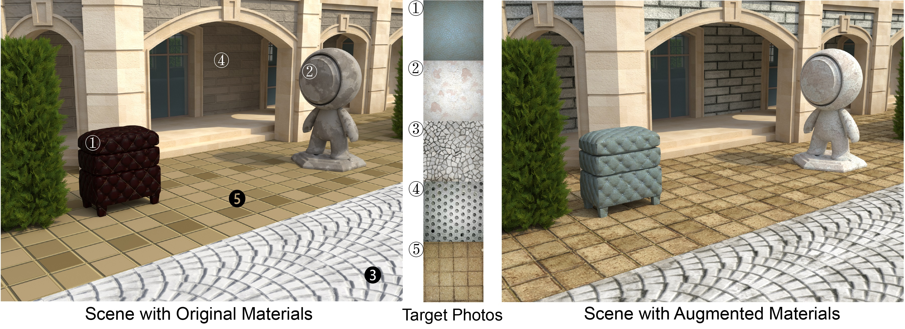

# Controlling Material Appearance by Examples

A by-example material appearance transfer method


Yiwei Hu, Miloš Hašan, Paul Guerrero, Holly Rushmeier, Valentin Deschaintre

In Computer Graphics Forum (Proc. of Eurographics Symposium on Rendering 2022). [[Project page]](https://yiweihu.netlify.app/project/hu2022control/)

---
## Installation
```
conda create -n mat_transfer python=3.8
conda activate mat_transfer
conda install pytorch torchvision cudatoolkit=11.3 -c pytorch
conda install ninja kornia imageio imageio-ffmpeg opencv matplotlib -c conda-forge
```
## Usage
Please download [pretrained models](https://drive.google.com/drive/folders/1PZngHLw6LbtlgloyOzZqdqtWFnCxycrR?usp=sharing) and put models into `./pretrained`. To run the code, see main.py for details. 
We include some examples in `./sample`

## Citation
```
@article {hu2022control,
  journal = {Computer Graphics Forum},
  title = {{Controlling Material Appearance by Examples}},
  author = {Hu, Yiwei and Hašan, Miloš and Guerrero, Paul and Rushmeier, Holly and Deschaintre, Valentin},
  year = {2022},
  publisher = {The Eurographics Association and John Wiley & Sons Ltd.},
  ISSN = {1467-8659},
  DOI = {10.1111/cgf.14591}
}
```

## Contact
If you have any question, feel free to contact yiwei.hu@yale.edu